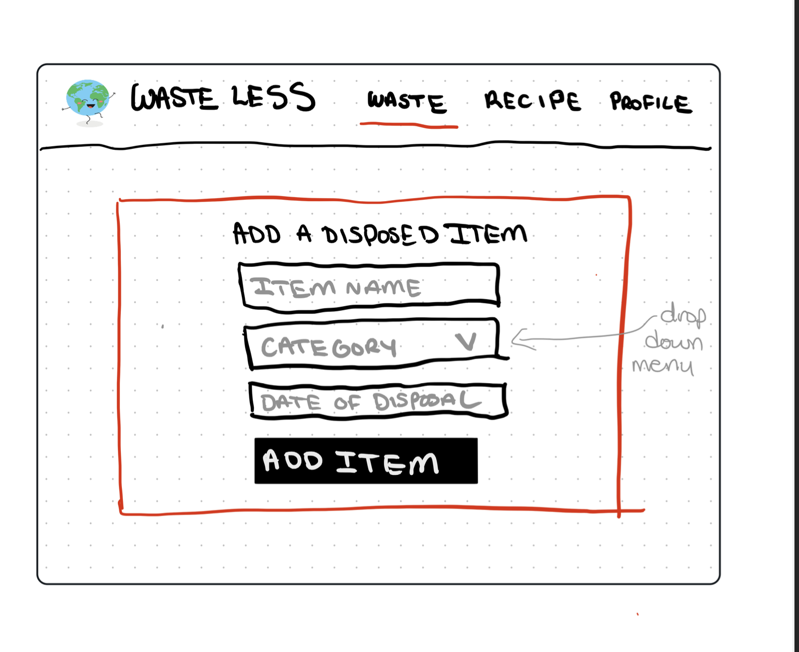

# Project Title
Waste Less (tentative)

## Overview

Waste Less is an app that is intended to incentivize individuals to produce less food waste in their home. 
 
### Problem

Food waste is a huge issue that many people experience in their homes and this has a negative impact on the planet, especially when food that takes a lot of resources to make are thrown away. With grocery prices continuously rising, people have a personal incentive to want to waste less food beyond the impacts it would have on the planet. People work well when they have rewards set in place to achieve goals and can see their progress being tracked over time in front of them. 


### User Profile

-People who throw away a lot of food that they didn't use
-People who want to see their impact on the environment
-People who want to save money on their groceries 

### Features

As a user:
    -Take a pledge to commit to wasting less food 
    -Input a food item that they have thrown away and return information about that item
    -See most commonly wasted items and the reason why
    -Get recipe recommendations based off an ingredient you need to use up  

As a logged in user:
    -See your impact on the planet with your food waste and tips on how to improve
    -Track your waste over weeks/months 
    -Earn rewards based on reducing your waste every week
    -Log your own pantry and perishable food items

## Implementation 

### Tech Stack

- React
- MySQL 
- Express 
- Client libraries: 
    - react
    - react-router
    - axios
-Server libraries:
    -express
    -knex

### APIs

Recipe API - https://api.api-ninjas.com/v1/recipe?query=
Carbon Emissions API - http://rapidapi.com 

My own API for user information and posting 

### Sitemap

-Homepage (where you take the pledge)
-Food waste tracking input
-Recipe recommendation 
-Login page 
-User stats for impact 

### Mockups

#### Home Page
(with authentication)


(without authentication)


#### Waste Page 


#### Recipe Page


#### Add Item Page 



#### Waste Item Details Page


#### Login Page

#### My Waste Stats Page

####

### Data

User: 
    -use_id (primary key)
    -username
    -email
    -password 

Wasted Items:
    -waste_id (primary key)
    -user_id (foreign key linking to user table)
    -food_item
    -quantity
    -date

Recipe: 
    -recipe_id (primary key)
    -user_id (foreign key)
    -name
    -ingredients
    -instructions

Environmental Impact:
    impact_id (primary key)
    waste_id (foreign key)
    C02_emissions
    Water_usage
    alternative_food

Every user can have many wasted items
Every wasted item can have one associated environmental impact
Recipe data exists separately UNLESS authentication is implemented and user can save a recipe to their favorites 


### Endpoints

**GET / recipe/ingredient**
-get recipes based on an ingredient

Request: 
GET https://api.api-ninjas.com/v1/recipe?query=

Parameters 
ingredient: The ingredient users want to search for recipes.
(EX: tomato)

Response 
[
  {
    "title": "Endive with Tomato Rosettes",
    "ingredients": "6 Medium-sized heads belgiam e|1 8-oz. package cream cheese (|3 tb Milk|2 oz Dried tomatoes, in oil (chop|Basil leaves or watercress s|Flower for garnish",
    "servings": "1 Servings",
    "instructions": "Calories per serving: 30 Fat grams per serving: 3 Approx. Cook Time: Cholesterol per serving: 7 ABOUT 30 MINUTES BEFORE SERVING OR EARLY IN DAY: Separate leaves from heads of Belgiam endive (you should be able to get 6 pretty leaves from each endive). Reserve small leaves and centers for salad another day. Rinse leaves under running cold water; pat dry with paper towels. In small bowl, with mixer at medium speed, beat cream cheese until smooth. Gradually beat in milk until blended. With spoon, stir in chopped dried tomatoes. Spoon cream-cheese filling into decorating bag with large rosette tube. Place a basil leaf or small watercress sprig on each endive leaf. Pipe some filling onto basil on wide end of each endive leaf. Arrange endive leaves on platter; garnish platter with flower. Cover and refrigerate until ready to serve. MAKES 3 DOZEN HORS D'OEUVRES"
  },
  {
    "title": "English Muffin W/ham, Tomatoes and Pesto",
    "ingredients": "1 Stick butter|8 oz Cream cheese|1 Clove garlic; minced|6 English muffins; halved|12 sl Deli baked ham; cut to fit muffin halves|12 sl Tomato|4 tb PESTO:|4 c Fresh basil leaves; washed and stripped from stems|4 Cloves garlic|1/4 c Olive oil|1/4 c Pine nuts|1 c Freshly grated Parmesan cheese",
    "servings": "6 Servings",
    "instructions": "Place the muffin halves on a baking sheet. Spead each with a portion of the cheese mixture. Then top each muffin with a slice of ham and a slice of tomato. Spread pesto on top of each tomato, using about 1 tsp. per tomato. Place a dollop of the cream cheese mixture on top of that and bake at 400 degrees for about 20 mintes or unil the cheese has melted and is slightly browned. Pesto: Blend until a paste forms...you may have to shove it down with a spatula several times in the blender container. A food processor does not do this as well as a blender! Freeze and cut into 1\" cubes any left over pesto and serve with pasta. MASTERCOOK RECIPES LIST SERVER"
  },
]

**POST /waste/id**
-upload an item you have thrown away 

Request Body
{
    "foodItemName": "Apple",
    "quantity": 2,
    "reason": "Expired"
}

Response Body
{
    "wasteId": 123,
    "foodItemName": "Apple",
    "quantity": 2,
    "reason": "Expired",
    "timestamp": "2024-03-20T12:00:00Z"
}

**GET /environmental-impact/:id**

Request
rapidapi.com/impact/product_name

Parameters
product_name - the name of the item that has been thrown away

Response
{
"product_name": "Unsweetened Vanilla Almond Milk",
  "median_kg_co2_per_kg": 1.08,
  "impact_breakdown": {
    "land_use_change": "0%",
    "feed_production": "0%",
    "farming": "57%",
    "processing": "10%",
    "transportation": "23%",
    "packaging": "9%",
    "losses": "0%"
  }
  "methodology_used": "GHG Protocol",
  "system_boundaries": "Farm to Retail",
  "impact_relative_to_average": "This product has a 64% lower impact than the average product in 'Milk and alternatives'",
  "lower_impact_alternatives": [
    {
      "product_name": "Oat-based milk drink, plain",
      "impact_difference": "This product has a 66% lower impact than Unsweetened Vanilla Almond Milk"
    },
    {
      "product_name": "Oat-based milk drink, flavored",
      "impact_difference": "This product has a 66% lower impact than Unsweetened Vanilla Almond Milk"
    },
    {
      "product_name": "Soy milk drink, plain, fortified with calcium",
      "impact_difference": "This product has a 61% lower impact than Unsweetened Vanilla Almond Milk"
    }
  ]
}

**POST /users/register**

- Add a user account

Parameters:

- email: User's email
- password: User's provided password

Response:
```
{
    "token": "seyJhbGciOiJIUzI1NiIsInR5cCI6IkpXVCJ9.eyJzdWIiOiIxMjM0NTY3ODkwIiwibmFtZSI6I..."
}
```
**POST /users/login**

- Login a user

Parameters:
- email: User's email
- password: User's provided password

Response:
```
{
    "token": "seyJhbGciOiJIUzI1NiIsInR5cCI6IkpXVCJ9.eyJzdWIiOiIxMjM0NTY3ODkwIiwibmFtZSI6I..."
}


### Auth

- JWT auth
    - Before adding auth, all API requests will be using a fake user with id 1
    - Added after core features have first been implemented
    - Store JWT in localStorage, remove when a user logs out
    - Add states for logged in showing different UI in places listed in mockups

## Roadmap

WEEK ONE: 

Preparation:

-Create client
    -react project with folder structure for pages and components

-Create server
    -express project with routing for user information and posting 

-Create migrations for user table and wasted items table 

-Create seeds with sample data for wasted items 

Design: 

-Design the home page with the pledge sections that leads into the rest of the site
    -Create reusable SASS for colors and consistent styling across all pages (choose colors, fonts, etc)

Features:

-Log thrown away items
    -create post /users/waste endpoint (server)
    -create form to submit information about this item (client)
        -user inputs the item
        -list of reasons to chose from 
        -user inputs quantity
    -Once posted, it is displayed for the user to see 

-Click on thrown away item to display information about it
    -make axios request to the climate API to get information about the food item (server)
    -display this information in UI after the user clicks on a posted item (client)

WEEK TWO: 

-Search a recipe based on ingredient
    -make axios request to the recipe API to get a list of recipes based on ingredient
    -display this information (client)

-See your food waste data
    -Implement a page to display a user's food waste data, list of thrown-away items and their details
    -If authentication is implemented, this would pull up user specific information

-Create account 
    -Implement register page + form (client)
    -Create POST /users/register endpoint (server)

-Login to account
    - Implement login page + form
    - Create POST /users/login endpoint

-Fix bugs 


## Nice-to-haves

-Authentication
-Tracking the money saved over time in addition to the climate impacts
-Reward badges for logged in users when they reduce their waste by a certain amount or save a certain amount of money
-Pantry feature where a user can upload everything they have in their cupboard and fridge
-Personalized tips for wasting less based on the items most wasted and reasons 
-Users can log their favorite recipes 
